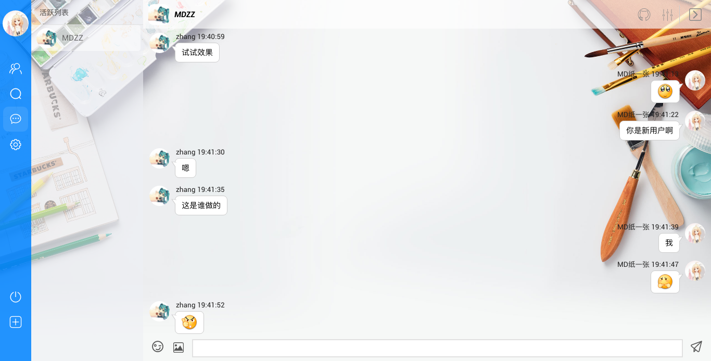

## A Real-Time Chat Room built with React

Online demo：[http://cr.mdzzapp.com](http://cr.mdzzapp.com)

### Updates

- New plugin system（based on [https://github.com/blackmiaool/jquery-image-explode](https://github.com/blackmiaool/jquery-image-explode)）

### Features

- Register user, login and logout, private chat, group chat, browse history
- Create group, join group, search user, search group
- Send image, bookmark image, image galleries
- Customize avatar, modify and browse personal information
- Desktop notification, sound notification, title icon notification
- Block and follow user
- Switch notification and fullscreen, customize background image
- Plugin system

### Screenshot



### Install

```
git clone https://github.com/redsx/CR.git
cd CR
npm install
npm run-script client-start # pack front-end code
npm start # open server, open http://locahost:3000
```

#### Tips:

- Check whether you installed the mongodb and the nodejs(v6.0+) before running the project.
- If the port number of your mongodb is not 54321, you should change the `PROT` variable in `./server/config/mongo-config.js` to it before running `npm start`.
- If you fail to install the bcrypt, you can use bcrypt-nodejs to replace it. If you do so, please follow the comments in `./server/controller/user.js` to change the parameters.

### Route Map

- <del>Build an android edition with rn</del>
- Sending code function
