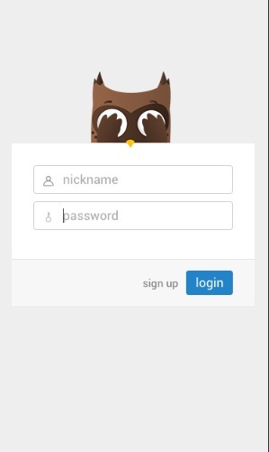

## CHATROOM—CR

在线地址：[http://cr.mdzzapp.com](http://cr.mdzzapp.com)

### 最新内容

- 图片查看

 

- 图片表情包

 

- title提醒

 


- @功能
- 滚动条优化
- 拖拽功能

### 下版内容预告
- 后台将改用koa
- 前端改用socket.io

### 功能列表

- 实现群聊私聊
- 实现图片表情包
- 实现机器人陪聊
- 实现桌面提醒，音效提醒
- 实现特别关注
- 实现屏蔽功能
- 实现图片黏贴发送功能

### 技术栈
- react
- redux
- bable
- webpack

### store结构说明

```
|--pageState // 控制页面ui状态
|--userState // 存放用户登录信息
|--onlineUsers // 存放在线用户信息
|--messages // 存放消息
|--privateMessages // 存放私聊消息
|--setting // 存放设置
|--imageSlide //存放图片信息，查看图片使用
|--storageExpressions //存放表情包
```
### 移动端效果展示

机器人：


登录&注册界面：



菜单栏：


好友设置：


个人设置：


### 安装

1. git clone this project
2. cd into the folder
3. run npm install
4. run webpack
