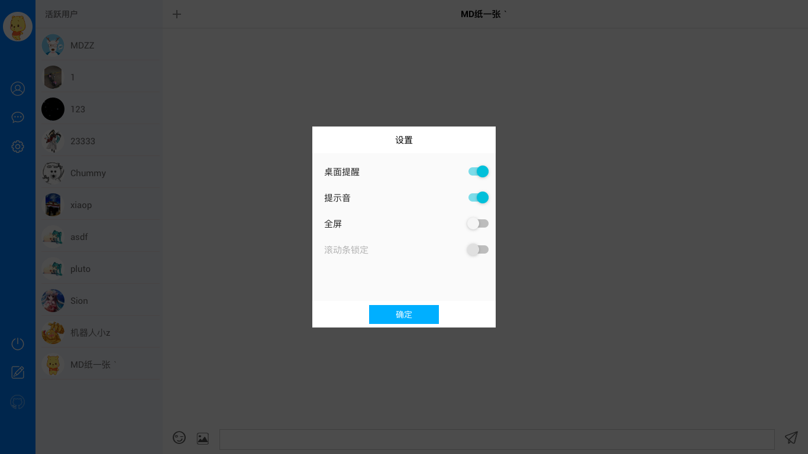

## CHATROOM—CR

在线地址：[http://cr.mdzzapp.com](http://cr.mdzzapp.com)

### 最新内容

- 使用immutable.js优化了react的render
- 使用less
- 增加设置界面，修改资料卡片
- 使用react-router将login与signup整合到react中

### 下版内容预告
- 增加markdown编辑器

### 技术栈
- react
- redux
- bable
- webpack

### store结构说明

```
|--pageState // 控制页面ui状态
|--userState // 存放用户登录信息
|--onlineUsers // 存放在线用户信息
|--messages // 存放消息
|--privateMessages // 存放私聊消息
|--setting // 存放设置
|--imageSlide //存放图片信息，查看图片使用
|--storageExpressions //存放表情包
```
### 效果展示

登录&注册界面：


菜单栏：


个人面板：


好友面板：


系统设置：



图片查看


图片表情包

 

title提醒

 


### 安装

1. cd CR
2. npm install
3. npm client-start 打包前端
4. npm start 开启server，访问 http://localost:3000

#### tips:

1. 在安装使用之前先修改数据库信息 mongodb：`server/config/mongo-config.js`，mysql暂不支持
2. 如果遇到bcrypt无法install可用bcrypt-nodejs代替，**注意替换后函数参数会有略微不同请查看文档**


